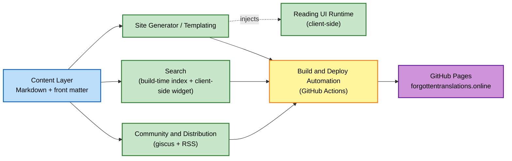

# Component Dependency

Per Application Design plan Q4/A: data flow is one-directional from Content Layer outward. No component writes back to Content Layer at build time.

## Dependency Matrix

| Component | Depends On | Used By |
|---|---|---|
| Content Layer | (none — source of truth) | Site Generator / Templating, Search, Community & Distribution |
| Site Generator / Templating | Content Layer | Build & Deploy Automation (Site Build Service), Reading UI Runtime (injected into rendered pages) |
| Reading UI Runtime | (rendered page markup from Site Generator) | End reader's browser |
| Search | Content Layer | Build & Deploy Automation (Site Build Service); Search UI runs in reader's browser |
| Community & Distribution | Content Layer | Build & Deploy Automation (Site Build Service, for RSS); reader's browser (for giscus comments) |
| Build & Deploy Automation | Content Layer, Site Generator / Templating, Search, Community & Distribution | GitHub Pages (hosting) |

## Data Flow Diagram



### Text Alternative
```
Content Layer --> Site Generator / Templating --> Build & Deploy Automation --> GitHub Pages
Content Layer --> Search --> Build & Deploy Automation
Content Layer --> Community & Distribution --> Build & Deploy Automation
Site Generator / Templating -- injects --> Reading UI Runtime (runs in reader's browser)
```

## Communication Patterns
- All communication is build-time function calls / data-passing within a single build process — no network calls between components (no APIs, no message queues).
- The only "runtime" communication is client-side: the Reading UI Runtime and Search widget run as JavaScript in the reader's browser, reading data that was baked into the static output at build time (plus `localStorage` for preferences).
- giscus comments are the one point where the browser talks to an external third-party service (GitHub Discussions) directly — not mediated by this project's own components.
