# Execution Plan

## Detailed Analysis Summary

### Transformation Scope

- **Project Type**: Greenfield — not applicable (no existing system to transform)

### Change Impact Assessment

- **User-facing changes**: Yes — entire site is new user-facing product (Reader browsing/reading/customizing; Translator publishing workflow)
- **Structural changes**: Yes — new static site architecture (content layer, site generator, reading UI, search, comments, RSS, CI/CD)
- **Data model changes**: Yes — new front-matter schema for titles and chapters (categories, status, synopsis, cover, credits)
- **API changes**: No — no APIs; purely static content and client-side behavior
- **NFR impact**: Yes — performance (static/lightweight JS), accessibility (typography controls, mobile-first), deployment (GitHub Actions + GitHub Pages + custom domain)

### Component Relationships

- **Content Layer**: Markdown files + front matter (titles, chapters) — source of truth
- **Site Generator/Build**: Static site generator (framework TBD in NFR Requirements) consumes Content Layer, produces static HTML/CSS/JS
- **Reading UI**: Templates/components for home, catalog, category, title, chapter, about pages; theme/typography controls
- **Search**: Client-side search index built from Content Layer metadata
- **Community/Distribution**: giscus (comments) and RSS feed generation, both derived from Content Layer
- **CI/CD & Hosting**: GitHub Actions workflow builds the Site Generator output and deploys to GitHub Pages under the custom domain

### Risk Assessment

- **Risk Level**: Low — static site, no backend, no user data, no authentication; rollback is a simple Git revert
- **Rollback Complexity**: Easy
- **Testing Complexity**: Simple — mostly build verification, link/render checks, and a small set of pure-function tests (front-matter parsing)

## Workflow Visualization

```mermaid
flowchart TD
    Start(["User Request"])

    subgraph INCEPTION["INCEPTION PHASE"]
        WD["Workspace Detection<br/>COMPLETED"]
        RA["Requirements Analysis<br/>COMPLETED"]
        US["User Stories<br/>COMPLETED"]
        WP["Workflow Planning<br/>IN PROGRESS"]
        AD["Application Design<br/>EXECUTE"]
        UG["Units Generation<br/>SKIP"]
    end

    subgraph CONSTRUCTION["CONSTRUCTION PHASE"]
        FD["Functional Design<br/>EXECUTE"]
        NFRA["NFR Requirements<br/>EXECUTE"]
        NFRD["NFR Design<br/>EXECUTE"]
        ID["Infrastructure Design<br/>EXECUTE"]
        CG["Code Generation<br/>EXECUTE"]
        BT["Build and Test<br/>EXECUTE"]
    end

    subgraph OPERATIONS["OPERATIONS PHASE"]
        OPS["Operations<br/>PLACEHOLDER"]
    end

    Start --> WD
    WD --> RA
    RA --> US
    US --> WP
    WP --> AD
    AD --> UG
    UG --> FD
    FD --> NFRA
    NFRA --> NFRD
    NFRD --> ID
    ID --> CG
    CG --> BT
    BT -.-> OPS
    BT --> End(["Complete"])

    style WD fill:#4CAF50,stroke:#1B5E20,stroke-width:3px,color:#fff
    style RA fill:#4CAF50,stroke:#1B5E20,stroke-width:3px,color:#fff
    style US fill:#4CAF50,stroke:#1B5E20,stroke-width:3px,color:#fff
    style WP fill:#4CAF50,stroke:#1B5E20,stroke-width:3px,color:#fff
    style AD fill:#FFA726,stroke:#E65100,stroke-width:3px,stroke-dasharray: 5 5,color:#000
    style UG fill:#BDBDBD,stroke:#424242,stroke-width:2px,stroke-dasharray: 5 5,color:#000
    style FD fill:#FFA726,stroke:#E65100,stroke-width:3px,stroke-dasharray: 5 5,color:#000
    style NFRA fill:#FFA726,stroke:#E65100,stroke-width:3px,stroke-dasharray: 5 5,color:#000
    style NFRD fill:#FFA726,stroke:#E65100,stroke-width:3px,stroke-dasharray: 5 5,color:#000
    style ID fill:#FFA726,stroke:#E65100,stroke-width:3px,stroke-dasharray: 5 5,color:#000
    style CG fill:#4CAF50,stroke:#1B5E20,stroke-width:3px,color:#fff
    style BT fill:#4CAF50,stroke:#1B5E20,stroke-width:3px,color:#fff
    style OPS fill:#FFF59D,stroke:#F57F17,stroke-width:2px,stroke-dasharray: 5 5,color:#000
    style Start fill:#CE93D8,stroke:#6A1B9A,stroke-width:3px,color:#000
    style End fill:#CE93D8,stroke:#6A1B9A,stroke-width:3px,color:#000
    style INCEPTION fill:#BBDEFB,stroke:#1565C0,stroke-width:3px,color:#000
    style CONSTRUCTION fill:#C8E6C9,stroke:#2E7D32,stroke-width:3px,color:#000
    style OPERATIONS fill:#FFF59D,stroke:#F57F17,stroke-width:3px,color:#000

    linkStyle default stroke:#333,stroke-width:2px
```



### Text Alternative

```
INCEPTION PHASE
- Workspace Detection (COMPLETED)
- Requirements Analysis (COMPLETED)
- User Stories (COMPLETED)
- Workflow Planning (IN PROGRESS)
- Application Design (EXECUTE)
- Units Generation (SKIP)

CONSTRUCTION PHASE (single unit: "novels-site")
- Functional Design (EXECUTE)
- NFR Requirements (EXECUTE)
- NFR Design (EXECUTE)
- Infrastructure Design (EXECUTE)
- Code Generation (EXECUTE)
- Build and Test (EXECUTE)

OPERATIONS PHASE
- Operations (PLACEHOLDER)
```

## Phases to Execute

### INCEPTION PHASE

- [x] Workspace Detection (COMPLETED)
- [x] Requirements Analysis (COMPLETED)
- [x] User Stories (COMPLETED)
- [x] Workflow Planning (IN PROGRESS — this document)
- [ ] Application Design — **EXECUTE**
  - **Rationale**: Several logical components need boundaries defined before code generation: Content Layer (front-matter schema), Site Generator/Build, Reading UI, Search, Community/Distribution (comments+RSS), CI/CD. Component dependencies (e.g., search index and RSS both derive from Content Layer) need clarification.
- [ ] Units Generation — **SKIP**
  - **Rationale**: This is a single, simple unit of work — one static site repository, no independently-deployable services or packages. No decomposition into multiple units adds value.

### CONSTRUCTION PHASE (single unit: "novels-site")

- [ ] Functional Design — **EXECUTE**
  - **Rationale**: A new data model (front-matter schema for titles/chapters, category taxonomy, status enum, chapter ordering) needs definition, and PBT property identification for the front-matter parsing logic is best captured here.
- [ ] NFR Requirements — **EXECUTE**
  - **Rationale**: requirements.md explicitly deferred the static site generator choice (Astro vs. Eleventy/11ty), analytics tool choice, and search library choice to this stage.
- [ ] NFR Design — **EXECUTE**
  - **Rationale**: Once the tech stack is selected, the theming/typography architecture, search integration, and comments/RSS integration patterns need to be worked out concretely.
- [ ] Infrastructure Design — **EXECUTE**
  - **Rationale**: Deployment architecture must be mapped: GitHub Actions build workflow, GitHub Pages configuration, custom domain `CNAME` file, and required DNS records for `forgottentranslations.online`.
- [ ] Code Generation — **EXECUTE (ALWAYS)**
  - **Rationale**: Implementation planning and code generation needed to produce the actual site.
- [ ] Build and Test — **EXECUTE (ALWAYS)**
  - **Rationale**: Build verification, rendering checks, and PBT-scoped unit tests (front-matter parsing round-trip/invariants) needed before considering the site done.

### OPERATIONS PHASE

- [ ] Operations — **PLACEHOLDER**
  - **Rationale**: Future deployment/monitoring workflow expansion; current build/deploy is fully covered by Infrastructure Design + Build and Test.

## Estimated Timeline

- **Total Stages Remaining**: 6 (Application Design, Functional Design, NFR Requirements, NFR Design, Infrastructure Design, Code Generation, Build and Test — 7 including Code Gen/Build&Test)
- **Estimated Duration**: Single incremental session-based build; no fixed calendar timeline (AI-DLC stages are checkpoint-driven, not time-boxed)

## Success Criteria

- **Primary Goal**: A working, mobile-first static site that publishes Markdown-authored translated novel content, deployable to GitHub Pages under `forgottentranslations.online`, satisfying all approved user stories
- **Key Deliverables**:
  - Content schema/conventions (front matter for titles and chapters)
  - Static site generator project with all pages (home, catalog, category, title, chapter, about)
  - Reading customization (theme, font, size, spacing) persisted via localStorage
  - Client-side search, giscus comments, RSS feed
  - GitHub Actions CI/CD to GitHub Pages with custom domain configured
- **Quality Gates**:
  - Build succeeds and produces valid static output
  - PBT-scoped tests (round-trip/invariant on front-matter parsing) pass
  - Manual verification of mobile-first responsive layout and theme/typography persistence
